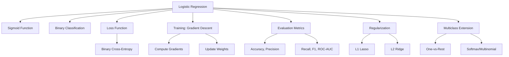

# 🎯 Logistic Regression Interview Prep (Markdown Version)

---

## 🧠 Flashcards – Quick Q\&A

### Q1: What is logistic regression?

> A classification algorithm that models the probability that a given input belongs to a certain class using a sigmoid function.

### Q2: Why not use linear regression for classification?

> Linear regression outputs unbounded values; logistic regression bounds the output between 0 and 1 using sigmoid.

### Q3: What is the sigmoid function?

> $\sigma(z) = \frac{1}{1 + e^{-z}}$, used to convert any real value into a probability.

### Q4: What is the loss function used?

> Binary Cross-Entropy Loss:
> $L = -[y \cdot \log(\hat{y}) + (1 - y) \cdot \log(1 - \hat{y})]$

### Q5: What is regularization?

> A technique to avoid overfitting by penalizing large weights (L1: Lasso, L2: Ridge).

### Q6: Can logistic regression handle multiple classes?

> Yes, using One-vs-Rest or Softmax (Multinomial Logistic Regression).

### Q7: What is the decision boundary in logistic regression?

> It's the threshold where the predicted probability equals 0.5. Mathematically, $\hat{y} = 0.5$ implies $z = 0$, which means $w^T x + b = 0$.

---

## 📐 Logistic Regression Formulas

### 1. Linear Combination (Logit):

$$
z = w^T x + b
$$

### 2. Sigmoid Function:

$$
\hat{y} = \sigma(z) = \frac{1}{1 + e^{-z}}
$$

### 3. Binary Cross-Entropy Loss:

$$
L = -[y \cdot \log(\hat{y}) + (1 - y) \cdot \log(1 - \hat{y})]
$$

### 4. Gradient of Loss w\.r.t weights:

$$
\frac{\partial L}{\partial w} = (\hat{y} - y) x
$$

### 5. Gradient Descent Weight Update:

$$
w := w - \alpha \cdot \frac{\partial L}{\partial w}
$$

Where:

* $w$: weights vector
* $b$: bias
* $\alpha$: learning rate
* $x$: input features
* $y$: true label
* $\hat{y}$: predicted probability

---

## 🧭 Mind Map – Concept Breakdown

---

## 🎤 Mock Interview Q\&A Sheet

### 🧩 Question 1: Explain Logistic Regression

**You:** Logistic regression is a classification algorithm that models the probability of class membership using the sigmoid function. The output ranges from 0 to 1 and is interpreted as a probability.

### 🧩 Question 2: How does logistic regression learn parameters?

**You:** It uses gradient descent to minimize the binary cross-entropy loss by updating weights based on partial derivatives of the loss.

### 🧩 Question 3: What's the intuition behind the sigmoid function?

**You:** It transforms linear output (logit) into a probability between 0 and 1, which makes it interpretable for classification.

### 🧩 Question 4: How do you interpret the coefficients?

**You:** Each coefficient represents the change in log-odds for a one-unit increase in the feature, holding others constant.

### 🧩 Question 5: What if your dataset is imbalanced?

**You:** Use class weights, oversampling/undersampling, or SMOTE. Also, focus on metrics like precision, recall, and F1-score.

### 🧩 Question 6: How is logistic regression different from SVM?

**You:** Logistic regression outputs probabilities; SVM maximizes the margin between classes and is better for outlier robustness.

### 🧩 Question 7: What are its limitations?

**You:** Assumes linear boundary in log-odds space, not suitable for highly non-linear patterns, sensitive to outliers.

### 🧩 Question 8: What is the role of the threshold in logistic regression?

**You:** The threshold (commonly 0.5) is used to convert predicted probabilities into class labels. Changing it affects precision and recall trade-off.

### 🧩 Question 9: What metrics are best to evaluate a logistic regression model?

**You:** Besides accuracy, use precision, recall, F1-score, and ROC-AUC especially in imbalanced datasets.

### 🧩 Question 10: What are log-odds?

**You:** Log-odds are the logarithm of the odds ratio. In logistic regression, the linear combination $w^T x + b$ represents the log-odds of the positive class.

### 🧩 Question 11: What is multicollinearity and how does it affect logistic regression?

**You:** Multicollinearity occurs when independent variables are highly correlated. It inflates coefficient variance and can make the model unstable.

### 🧩 Question 12: How does regularization help logistic regression?

**You:** It penalizes large coefficients to prevent overfitting. L1 can also perform feature selection by shrinking some weights to zero.

### 🧩 Question 13: Why we use wT in  z = wTx+b ?
**You:** The transpose is used for matrix multiplication compatibility.
    - Suppose:
       - w = weight vector of shape(n,1)
       - x = feature vector of shape(n,1)

    - Without transpose:
       - w⋅x=(n,1)⋅(n,1)→ Not allowed(incompatible)

    - With transpose:
       - wT⋅x=(1,n)⋅(n,1) →Scalar(1,1),which is valid.

- w^T x means: take a weighted sum of all input features.
- It gives a single number (z) — the logit — which is passed through the sigmoid to get a probability.     

---

