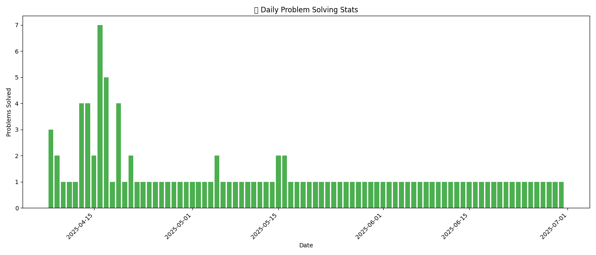
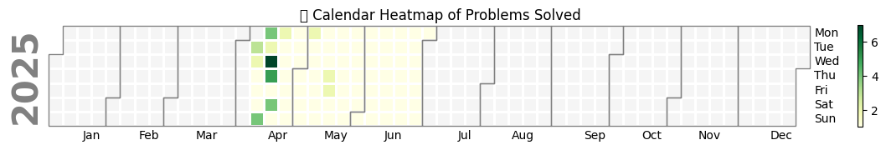

# 📘 Data Science Coding Log
Welcome to my **coding practice log**, where I track my **daily problem-solving** journey across platforms like **LeetCode**, **GeeksforGeeks**, and others. This log helps me stay **consistent** and **focused** while improving my **data science** and **algorithmic thinking**.

## ✍️ Goal

The goal is to **build consistent problem-solving habits** and **enhance my skills** in **data science** and **algorithms**.

---

## 📈 Stats

<!-- STATS_START -->
# 📊 Coding Practice Stats

- ✅ Problems solved this week: **12**
- 🗖️ Problems solved this month: **44**
- 📌 Current daily streak: **19 days**
- 🏷️ Most frequent tags: **DSA** (38), **Array** (34), **Binary Search** (27), **Sorting** (6), **Math** (5)

<!-- STATS_END -->

---

## 📅 Daily Problem Tracker

### 📚 Difficulty Legend

🟢 Easy | 🟡 Medium | 🔴 Hard

<!-- PROBLEM_TABLE_START -->
### 📘 Data Science Coding Log - Problem Tracker

| Date       | Problem Name                                                                                               | Platform    | Difficulty | Tags                                     |
|------------|------------------------------------------------------------------------------------------------------------|-------------|------------|------------------------------------------|
| 2025-04-08 | [Two Sum](./2025-04-08/two_sum.md)                                                                         | LeetCode    | Easy       | Array, Hash Map, DSA                    |
| 2025-04-08 | [Valid Anagram](./2025-04-08/valid_anagram.md)                                                             | LeetCode    | Easy       | Array, DSA                              |
| 2025-04-08 | [Contains Duplicate](./2025-04-08/contains_duplicate.md)                                                   | LeetCode    | Easy       | Array, Duplicate, DSA                   |
| 2025-04-09 | [Concatenation of Array](./2025-04-09/concatenation_of_array.md)                                           | LeetCode    | Easy       | Array, Concatenation, DSA               |
| 2025-04-09 | [Valid Palindrome](./2025-04-09/valid_palindrome.md)                                                       | LeetCode    | Easy       | String, Two Pointers, DSA               |
| 2025-04-10 | [Longest Common Prefix](./2025-04-10/longest_common_prefix.md)                                             | LeetCode    | Easy       | String, Prefix, DSA                     |
| 2025-04-11 | [Group Anagrams](./2025-04-11/group_anagrams.md)                                                           | LeetCode    | Medium     | Hash Map, Sorting, DSA                  |
| 2025-04-12 | [Binary Search](./2025-04-12/binary_search.md)                                                             | LeetCode    | Easy       | Binary Search, Array, DSA               |
| 2025-04-13 | [Search Insert Position](./2025-04-13/search_insert_position.md)                                           | LeetCode    | Easy       | Binary Search, Array, DSA               |
| 2025-04-13 | [Find Smallest Letter Greater Than Target](./2025-04-13/find_smallest_letter_greater_than_target.md)       | LeetCode    | Easy       | Binary Search, Array, DSA               |
| 2025-04-13 | [Count Negative Numbers in a Sorted Matrix](./2025-04-13/count_negative_numbers_in_a_sorted_matrix.md)     | LeetCode    | Medium     | Binary Search, Matrix, DSA              |
| 2025-04-13 | [Find First and Last Position of Element in Sorted Array](./2025-04-13/find_first_and_last_position_of_element_in_sorted_array.md) | LeetCode | Medium     | Binary Search, Array, DSA               |
| 2025-04-14 | [Find Right Interval](./2025-04-14/find_right_interval.md)                                                 | LeetCode    | Medium     | Binary Search, Intervals, DSA           |
| 2025-04-14 | [Time-Based Key-Value Store](./2025-04-14/time-based_key-value_store.md)                                   | LeetCode    | Medium     | Hash Map, Binary Search, DSA            |
| 2025-04-14 | [Snapshot Array](./2025-04-14/snapshot_array.md)                                                           | LeetCode    | Medium     | Design, Binary Search, DSA              |
| 2025-04-14 | [Search in Rotated Sorted Array](./2025-04-14/search_in_rotated_sorted_array.md)                           | LeetCode    | Medium     | Binary Search, Array, DSA               |
| 2025-04-15 | [Find Minimum in Rotated Sorted Array II](./2025-04-15/find_minimum_in_rotated_sorted_array_ii.md)         | LeetCode    | Hard       | Binary Search, Array, DSA               |
| 2025-04-15 | [Guess Number Higher or Lower](./2025-04-15/guess_number_higher_or_lower.md)                               | LeetCode    | Easy       | Binary Search, Game Theory, DSA         |
| 2025-04-16 | [First Bad Version](./2025-04-16/first_bad_version.md)                                                     | LeetCode    | Easy       | Binary Search, DSA                      |
| 2025-04-16 | [Search a 2D Matrix](./2025-04-16/search_a_2d_matrix.md)                                                   | LeetCode    | Medium     | Matrix, Binary Search, DSA              |
| 2025-04-16 | [Valid Perfect Square](./2025-04-16/valid_perfect_square.md)                                               | LeetCode    | Easy       | Math, Binary Search, DSA                |
| 2025-04-16 | [Sqrt(x)](./2025-04-16/sqrt(x).md)                                                                         | LeetCode    | Easy       | Math, Binary Search, DSA                |
| 2025-04-16 | [Arranging Coins](./2025-04-16/arranging_coins.md)                                                         | LeetCode    | Easy       | Math, Binary Search, DSA                |
| 2025-04-16 | [Kth Missing Positive Number](./2025-04-16/kth_missing_positive_number.md)                                 | LeetCode    | Medium     | Array, Binary Search, DSA               |
| 2025-04-16 | [Valid Triangle Number](./2025-04-16/valid_triangle_number.md)                                             | LeetCode    | Medium     | Array, Binary Search, DSA               |
| 2025-04-17 | [Peak Index in a Mountain Array](./2025-04-17/peak_index_in_a_mountain_array.md)                           | LeetCode    | Medium     | Binary Search, Array, DSA               |
| 2025-04-17 | [Find K Closest Elements](./2025-04-17/find_k_closest_elements.md)                                         | LeetCode    | Medium     | Binary Search, Array, DSA               |
| 2025-04-17 | [Median of Two Sorted Arrays](./2025-04-17/median_of_two_sorted_arrays.md)                                 | LeetCode    | Hard       | Binary Search, Array, DSA               |
| 2025-04-17 | [Single Element in a Sorted Array](./2025-04-17/single_element_in_a_sorted_array.md)                       | LeetCode    | Medium     | Binary Search, Array, DSA               |
| 2025-04-17 | [Random Pick with Weight](./2025-04-17/random_pick_with_weight.md)                                         | LeetCode    | Medium     | Binary Search, Array, DSA               |
| 2025-04-18 | [Longest Increasing Subsequence](./2025-04-18/longest_increasing_subsequence.md)                           | LeetCode    | Medium     | Array, Binary Search, DSA               |
| 2025-04-19 | [Russian Doll Envelopes](./2025-04-19/russian_doll_envelopes.md)                                           | LeetCode    | Hard       | Array, Binary Search, Sorting           |
| 2025-04-19 | [Number of Subsequences That Satisfy the Given Sum Condition](./2025-04-19/number_of_subsequences_that_satisfy_the_given_sum_condition.md) | LeetCode | Medium | Array, Sorting, DSA |
| 2025-04-19 | [H-Index II](./2025-04-19/h-index_ii.md) | LeetCode | 🟡 Medium | Array, Binary Search, DSA |
| 2025-04-19 | [Move Zeroes](./2025-04-19/move_zeroes.md) | LeetCode | 🟢 Easy | Array, DSA |
| 2025-04-20 | [Find the Difference](./2025-04-20/find_the_difference.md) | LeetCode | 🟢 Easy | String, Bit Manipulation, Hash Table |
| 2025-04-21 | [Remove Element](./2025-04-21/remove_element.md) | LeetCode | 🟢 Easy | Array, Two Pointer, DSA |
| 2025-04-21 | [Majority Element](./2025-04-21/majority_element.md) | LeetCode | 🟢 Easy | Array, HashMap, Sorting, Boyer-Moore |
| 2025-04-22 | [Roman to Integer](./2025-04-22/roman_to_integer.md) | LeetCode | 🟢 Easy | Hash Table, Math, String |
| 2025-04-23 | [Sort an Array](./2025-04-23/sort_an_array.md) | LeetCode | 🟡 Medium | Array, Merge Sort, Quick Sort |
| 2025-04-24 | [Sort Colors](./2025-04-24/sort_colors.md) | LeetCode | 🟡 Medium | Array, Two Pointer, DSA |
| 2025-04-25 | [Can Make Arithmetic Progression From Sequence](./2025-04-25/can_make_arithmetic_progression_from_sequence.md) | LeetCode | 🟢 Easy | Array, Sorting, DSA |
| 2025-04-26 | [Plus One](./2025-04-26/plus_one.md) | LeetCode | 🟢 Easy | Array, Math, DSA |

<!-- PROBLEM_TABLE_END -->

---

## 📈 Visuals
---

### 📊 Progress Graph

Here's a bar chart of our actual daily problem-solving stats:

---
### 📅 Calendar Heatmap

---

## 🚀 Features

- 📈 **Stats Section**: Weekly and Monthly solved problems, and most frequent tags automatically updated.
- ✅ **Problem Tracker**: All solved problems and their details available for quick reference.
- 🎯 **Difficulty Tag**: Automatically tracks problem difficulty.
- 📅 **Calendar Heatmap**: Visualizes your streaks and activity.

---

## ✨ Inspirational Quote

> "The best way to predict the future is to invent it." — Alan Kay

---

## 📚 Check Out My Blogs

I write articles on **data science**, **algorithms**, and **machine learning**. Feel free to explore my writings!

- 📖 **[Read My Medium Blogs](https://medium.com/@dsdineshnitrr)**

---

## 📫 Connect with Me

Stay connected with me on **LeetCode** to check my progress, solutions, and rankings:

- 🖱️ **[My LeetCode Profile](https://leetcode.com/u/dineshnitrr/)**

---

